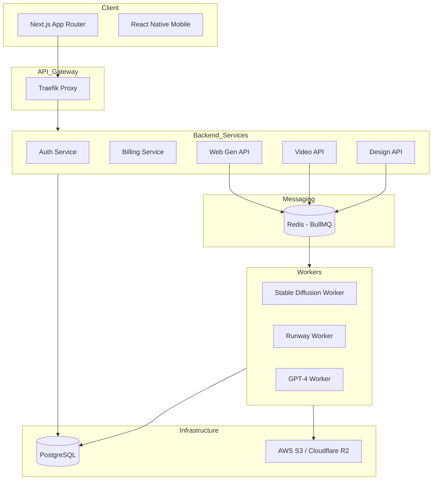

# Technical Architecture

ZAKSOFT Créations is built with a distributed microservices architecture designed for high availability and scalability.

## 1. High-Level Diagram

## 2. Component Breakdown

### Frontend (Next.js 14)
- **Framework**: React 18, Next.js 14 (App Router).
- **Styling**: Tailwind CSS with a custom Glassmorphism theme.
- **State Management**: React Context & Hooks.
- **Data Fetching**: Axios with custom interceptors for auth.

### Backend Services (Express.js)
- **Auth**: Handles JWT-based authentication and user profiles.
- **Billing**: Manages Stripe checkout sessions and webhooks.
- **Generation APIs**: Accept user prompts, verify credits, and enqueue jobs in BullMQ.

### Worker Engine (BullMQ)
- **Image Worker**: Calls Replicate SDXL API, downloads assets, and uploads to S3.
- **Video Worker**: Calls Runway Gen-2 API, handles audio mixing with FFmpeg, and uploads to S3.
- **Website Worker**: Calls OpenAI GPT-4 API to generate responsive code.

### Persistence & Storage
- **Database**: PostgreSQL with Prisma. Shared schema across services via `@zaksoft/database`.
- **Storage**: Any S3-compatible storage. Assets are stored with unique identifiers and private paths.
- **Cache**: Redis is used for BullMQ queues and job metadata.

## 3. Security
- **JWT**: Stateless authentication with short-lived tokens.
- **Secrets Management**: Sensitive API keys are stored in environment variables and never exposed to the frontend.
- **Transactional Integrity**: All credit debits and asset creations are performed within atomic database transactions.
