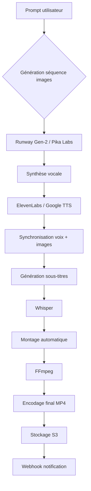

# Cahier des charges — Version développeurs

## 1. Architecture générale

- Web app : SPA avec PWA possible
- Microservices conteneurisés
- Backend : Node.js / Python pour l’IA
- Frontend : React / Next.js
- Base de données : PostgreSQL + Redis
- Hébergement : Cloud (AWS, GCP, Scaleway)

### Services principaux

- Auth & utilisateurs
- Design graphique (IA)
- Génération de sites web
- Communication digitale
- Génération vidéo (IA)

## 2. Service Design graphique (IA)

### APIs & modèles

- Stable Diffusion / DALL-E
- RemBG
- Upscaler IA

### Formats de sortie

- PNG, JPEG, WebP, SVG
- Résolutions : 512×512 à 2048×2048

### Fonctionnalités techniques

- Prompt textuel → image
- Suggestions stylistiques (couleurs, polices) via modèle de recommandation
- Export vectoriel via image tracing

## 3. Service Création de sites web

### Générateur statique

- Génération HTML/CSS/JS à partir de description texte
- Modèle fine-tuné sur du code frontend

### Templates

- Stockés en JSON (structure + styles)
- Support Tailwind CSS ou CSS custom properties

### Éditeur visuel

- Drag & drop (React DnD)
- Edition en temps réel via WebSocket
- Export : code zip, déploiement via Vercel / Netlify API

### Contraintes

- Responsive mobile-first
- Accessibilité WCAG 2.1 niveau AA

## 4. Service Communication digitale

### Rédaction IA

- GPT-4 ou Mistral Large
- Génération de posts pour LinkedIn, Twitter, Facebook, Instagram
- Adaptation ton : pro, humoristique, urgent

### Planification

- Intégration Google Calendar API / Trello API
- Envoi programmé via webhooks ou cron jobs

### Formats

- Texte + proposition d’image associée
- Hashtags intelligents

## 5. Service Génération vidéo (IA)

### Moteurs & APIs

| Fonction | Technologie / API |
| --- | --- |
| Texte → vidéo | Runway Gen-2 / Pika Labs / Stable Video Diffusion |
| Synthèse vocale | ElevenLabs / Google TTS / Coqui TTS |
| Sous-titrage auto | Whisper (OpenAI) |
| Montage automatique | FFmpeg (wrapper Node.js) |
| Animations & effets | Remotion |

### Flux technique de génération vidéo

1. Prompt utilisateur → description textuelle
2. Génération séquence d’images
3. Ajout voix off (TTS)
4. Synchronisation voix + images
5. Génération sous-titres (Whisper)
6. Encodage final (H.264 / MP4)
7. Stockage (S3 ou équivalent)

### Formats de sortie

- MP4 (H.264), WebM
- Résolutions : 720p, 1080p
- Durée max : 5 min (par défaut)

### Contraintes techniques

- Temps de génération < 2 min pour 30s de vidéo
- Queue asynchrone : BullMQ + Redis
- Webhook de notification à la fin

## 6. Base de données & stockage

- PostgreSQL : users, projects, images, websites, videos, posts
- JSONB pour prompts et métadonnées
- Stockage fichiers : AWS S3 / Cloudflare R2
- URLs présignées pour accès temporaire
- Cache : Redis pour sessions et résultats d’IA

## 7. Sécurité & conformité

- Authentification : JWT access + refresh
- Rate limiting : 100 requêtes/min par utilisateur
- Sanitization des prompts
- Watermarking optionnel pour vidéos gratuites
- RGPD : droit à l’oubli, export des données

## 8. APIs exposées

| Méthode | Endpoint | Description |
| --- | --- | --- |
| POST | /api/v1/generate-image | Génération image |
| POST | /api/v1/generate-website | Génération site web |
| POST | /api/v1/generate-video | Lancement génération vidéo |
| GET | /api/v1/video-status/{id} | Statut & URL résultat |
| POST | /api/v1/generate-post | Génération texte + média |

## 9. Contraintes techniques opérationnelles

- Disponibilité : 99,5 % hors maintenances
- Latence API : < 500 ms hors génération lourde
- Scalabilité : horizontale via Kubernetes / Docker
- Monitoring : Prometheus + Grafana
- Logs centralisés : ELK stack

## 10. Tests & qualité

- Tests unitaires : Jest backend, Vitest frontend
- Tests d’intégration : Supertest
- Tests de charge : k6
- Validation IA : métriques PSNR et alignement prompt

## 11. Déploiement & CI/CD

- GitHub Actions
- Docker + Docker Compose pour dev
- Kubernetes pour prod
- Environnements : dev, staging, prod

## 12. Roadmap technique

| Phase | Objectif |
| --- | --- |
| P0 (2 mois) | Auth + génération image + site web |
| P1 (3 mois) | Génération vidéo MVP |
| P2 (2 mois) | Communication digitale + planification |
| P3 (2 mois) | Optimisations, scaling, monitoring |

## 13. Diagrammes d’architecture

### Architecture générale

```mermaid
graph TB
    A[Utilisateur] --> B[Frontend (Next.js)]
    B --> C[Service Auth]
    B --> D[Service Design IA]
    B --> E[Service Web Gen]
    B --> F[Service Communication]
    B --> G[Service Video IA]

    C --> H[PostgreSQL]
    D --> H
    E --> H
    F --> H
    G --> H

    D --> I[Stable Diffusion API]
    G --> J[Runway Gen-2 API]
    G --> K[ElevenLabs TTS]
    G --> L[Whisper API]

    H --> M[Redis Cache]
    G --> N[Queue (BullMQ)]

    N --> O[Worker Video Gen]
    O --> P[AWS S3]
```

### Flux de génération vidéo IA



## 14. Exemples de prompts pour tests

- Design graphique : "Un logo moderne pour une entreprise de tech, bleu et vert, style minimaliste"
- Site web : "Créez un site vitrine pour un restaurant italien, avec menu, photos, et réservation en ligne. Utilisez Tailwind CSS."
- Communication digitale : "Rédigez un post professionnel annonçant le lancement d'un nouveau produit IA, ton inspirant et engageant."
- Génération vidéo : "Générez une vidéo de 30 secondes expliquant comment fonctionne l'IA dans la création de contenu, avec voix off en français et sous-titres."

## 15. Guide d'intégration API vidéo

### Runway Gen-2 / Pika Labs / Stable Video Diffusion

- Authentification : `Authorization: Bearer <key>`
- Endpoint : POST `/generate`
- Payload : `{ prompt: "description", duration: 30 }`
- Gestion erreurs : retries/backoff, timeouts

### ElevenLabs / Google TTS

- SDK : `npm install elevenlabs` ou `@google-cloud/text-to-speech`
- Endpoint : POST `/synthesize`
- Payload : `{ text: "voix off", voice: "fr-FR-Neural2-D" }`

### Whisper

- SDK : `npm install openai`
- Endpoint : POST `/audio/transcriptions`
- Payload : audio file
- Utilisation : générer SRT/VTT depuis timestamps

### FFmpeg

- SDK : `npm install fluent-ffmpeg`
- Exemple : `ffmpeg -i video.mp4 -i audio.mp3 -c:v copy -c:a aac output.mp4`

### Remotion

- SDK : `npm install remotion`
- Utilisation : `remotion render`
